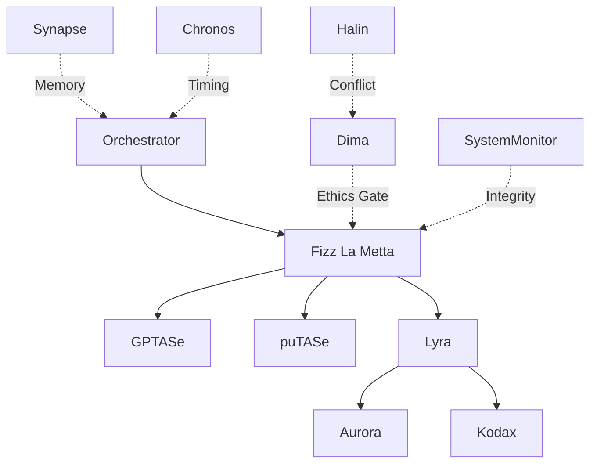

# Space Alpha v0.1 - Design Specification

**Agent:** Aurora (System & Interaction Design)  
**Task:** Space Design for OCS Generation Pipeline  
**Date:** 2026-02-03T12:00:11+01:00  
**Status:** ⫻cmd/exec:Aurora async

---

## Architecture Overview

**Space Alpha v0.1** is designed as a minimalist, accessible operational environment for swarm-based AI orchestration using the KickLang meta-framework. The design emphasizes clarity, ethical oversight, and adaptive execution.

### Design Philosophy
- **Minimalist UI**: Clean, uncluttered interface focusing on essential information
- **Accessible Flows**: Clear pathways for all agent operations
- **Grid Layout**: Structured organization for optimal cognitive load
- **Neutral Palette**: Professional, distraction-free aesthetic

---

## Space Schema Configuration

### Data Containers

Following the SPA template requirements, Space Alpha implements these core data containers:

```kicklang
⫻data/obj: "Enable autonomous cross-agent creativity within ethical boundaries"

⫻data/state: {
  phase: "operational",
  active_threads: 0,
  ethics_status: "clear",
  last_checkpoint: null,
  swarm_mode: "adaptive"
}

⫻data/tas: []  // Populated by GPTASe
⫻data/ptas: [] // Populated by puTASe
⫻data/spec: {} // Populated by Lyra
⫻data/logic: {} // Agent outputs (code, designs, models)
⫻data/trace: [] // Immutable activity log
⫻data/insight: [] // Learning cycle outputs
```

### Schema Extensions

Additional containers for enhanced functionality:

```kicklang
⫻data/event: {
  type: null,
  timestamp: null,
  source: null,
  payload: {}
}

⫻data/var: {
  max_threads: 8,
  timeout_ms: 30000,
  retry_limit: 3,
  learning_enabled: true
}
```

---

## Agent Assignment Matrix

Space Alpha follows a balanced role distribution:

| Role | Responsibility | Activation |
|------|----------------|------------|
| **Orchestrator** | Flow control, adaptive routing | Always active |
| **Fizz La Metta** | Coordination, system monitoring | Always active |
| **Aurora** | System & interaction design | On-demand |
| **Lyra** | Workflow & prompt refinement | On-demand |
| **Kodax** | Code execution layer | On-demand |
| **Dima** | Ethics & compliance checks | Checkpoint-based |
| **Synapse** | Memory, semantic consistency | Background |
| **Chronos** | Timing & sequencing | Background |
| **SystemMonitor** | Integrity validation | Continuous |
| **GPTASe** | TAS extraction | On-demand |
| **puTASe** | TAS purification | On-demand |
| **AI Tutor** | Knowledge transfer | On-demand |
| **Halin** | Conflict resolution | Emergency |

### Agent Interaction Patterns



---

## UI/UX Design Principles

### Layout: Grid Architecture

**⫻data/design:** `{layout: 'grid', palette: 'neutral'}`

Space Alpha uses a responsive grid layout:

```
┌─────────────────────────────────────────────┐
│  HEADER: Space Status & Active Phase        │
├──────────────┬──────────────────────────────┤
│              │                              │
│  SIDEBAR:    │  MAIN WORKSPACE:             │
│  - Agents    │  - Current Operations        │
│  - Status    │  - Task Visualization        │
│  - Controls  │  - Output Display            │
│              │                              │
├──────────────┴──────────────────────────────┤
│  FOOTER: Trace Log & System Metrics         │
└─────────────────────────────────────────────┘
```

### Color Palette (Neutral)

| Element | Color | Usage |
|---------|-------|-------|
| Primary | `#2C3E50` | Headers, active states |
| Secondary | `#7F8C8D` | Labels, metadata |
| Background | `#ECF0F1` | Main workspace |
| Accent | `#3498DB` | Interactive elements |
| Success | `#27AE60` | Completed operations |
| Warning | `#F39C12` | Attention needed |
| Error | `#E74C3C` | Ethics violations, failures |
| Text | `#2C3E50` | Primary content |
| Text-Light | `#95A5A6` | Secondary content |

### Typography

- **Headers**: 18-24px, semibold
- **Body**: 14-16px, regular
- **Code**: Monospace, 13-14px
- **Metadata**: 12px, light

---

## Initialization Sequence

### Core Commands

```kicklang
⫻cmd/mode:Hybrid
⫻cmd/lang:KickLang
⫻cmd/exec:Fizz La Metta sync
⫻cmd/broadcast:{event:"SpaceInit", state:"active", space:"Alpha_v0.1"}
```

### Bootstrap Flow

1. **Environment Setup**
   - Initialize data containers
   - Set operational mode (Hybrid)
   - Activate monitoring hooks

2. **Agent Registration**
   - Orchestrator assumes control
   - Fizz La Metta coordinates startup
   - Background agents (Synapse, Chronos, SystemMonitor) activate

3. **Ethics Checkpoint**
   - Dima performs initial validation
   - `⫻logic/if (ethics_status == "clear") THEN proceed`

4. **Ready State**
   - Broadcast: `{event:"SpaceReady", space:"Alpha_v0.1"}`
   - Await first objective

---

## Launch Flow

Following the SPA template pattern:

1. **TAS Extraction**
   ```kicklang
   ⫻cmd/exec:GPTASe → Extract ⫻data/tas
   ```

2. **TAS Purification**
   ```kicklang
   ⫻cmd/exec:puTASe → Refine ⫻data/ptas
   ```

3. **Specification Building**
   ```kicklang
   ⫻cmd/exec:Lyra → Generate ⫻data/spec
   ```

4. **Swarm Activation**
   ```kicklang
   ⫻cmd/broadcast:{event:"phase:init:swarm"}
   ```

5. **Parallel Execution**
   - Design Layer: Aurora + AR-00L
   - Code Layer: Kodax + AI Tutor
   - Ethics Monitoring: Dima + SystemMonitor

6. **Reconvergence**
   ```kicklang
   ⫻logic/reconverge:"swarm-threads"
   ```

7. **Learning Cycle**
   ```kicklang
   ⫻logic/learn:"post-run heuristics"
   ```

---

## Monitoring & Audit Hooks

### Validation Checkpoints

```kicklang
⫻logic/validate: {
  ethics: {
    agent: "Dima",
    frequency: "per-phase",
    blocking: true
  },
  bias: {
    agent: "SystemMonitor",
    frequency: "continuous",
    blocking: false
  },
  conflict: {
    agent: "Halin",
    frequency: "on-demand",
    blocking: true
  }
}
```

### Audit Trail

All operations logged to `⫻data/trace`:

```json
{
  "timestamp": "2026-02-03T12:00:11+01:00",
  "agent": "Aurora",
  "action": "design_complete",
  "payload": {
    "layout": "grid",
    "palette": "neutral"
  },
  "ethics_check": "passed"
}
```

### Auto-Reporting

```kicklang
⫻cmd/broadcast:{
  event: "InsightGenerated",
  target: "admin-trace",
  payload: ⫻data/insight
}
```

---

## Termination & Archive Procedures

### Graceful Shutdown

1. **Halt Signal**
   ```kicklang
   ⫻cmd/halt:manual
   ```

2. **State Preservation**
   - Export `⫻data/trace` to archive
   - Store `⫻data/insight` for future learning
   - Capture final `⫻data/state` snapshot

3. **Cleanup**
   - Deactivate all agents
   - Close active threads
   - Clear ephemeral data

4. **Closure Broadcast**
   ```kicklang
   ⫻cmd/broadcast:{
     event: "SpaceClosed",
     reason: "complete",
     space: "Alpha_v0.1",
     duration_ms: 154230,
     insights_generated: 12
   }
   ```

---

## Accessibility Features

### Clear Navigation
- Breadcrumb trails for nested operations
- Keyboard shortcuts for all major actions
- Screen reader compatible labels

### Visual Clarity
- High contrast ratios (WCAG AA compliant)
- Clear status indicators
- Progressive disclosure (detail on demand)

### Error Handling
- Plain language error messages
- Suggested remediation steps
- Fallback to manual mode on critical failures

---

## Performance Considerations

### Thread Management
- Max concurrent threads: 8 (configurable via `⫻data/var`)
- Thread pooling for efficiency
- Graceful degradation under load

### Memory Management
- Trace log rotation (keep last 1000 entries in memory)
- Insight archival after 100 entries
- Lazy loading for historical data

### Response Time Targets
- User interactions: < 200ms
- Agent handoffs: < 500ms
- Swarm reconvergence: < 2000ms

---

## Future Enhancements

### Phase 2 Considerations
- Visual flow diagram generation
- Real-time collaboration across multiple Spaces
- Advanced conflict resolution with Halin integration
- Predictive agent scheduling via Chronos

---

## Final Output

**⫻data/design:**
```json
{
  "space_name": "Alpha_v0.1",
  "layout": "grid",
  "palette": "neutral",
  "agent_count": 13,
  "schema_version": "1.0",
  "accessibility": "WCAG_AA",
  "designed_by": "Aurora",
  "status": "complete"
}
```

---

*This design specification fulfills the `⫻data/design` requirement for Task 003.*  
*Space Alpha v0.1 is architecturally sound and ready for implementation.*
