# OCS Architectural Context Summary

> Generated: 2026-02-03T09:27:20+01:00

## Current Architecture State

```mermaid
graph TD
    A[OCS Root Space] --> B[Task 000: Space Init]
    B --> C[Task 001: Handoff]
    C --> D[Task 002: Verification]
    D --> E[Awaiting User Directive]
    
    style B fill:#2d5a2d,stroke:#4a4
    style D fill:#2d5a2d,stroke:#4a4
    style C fill:#5a5a2d,stroke:#aa4
    style E fill:#2d2d5a,stroke:#44a
```

## Key Findings

### Protocol Compliance
- **OCS Protocol v2.1:** Validated
- **Ethics Status:** Nominal
- **Security:** Encrypted channels active

### System Insights
1. Modular/Fractal design pattern adopted
2. Adaptive network timeout (+5ms heuristic)
3. Swarm latency: 12ms (well under 50ms target)

### Active Components
| Component | Status |
|-----------|--------|
| Registry | Online |
| Loader | Ready |
| Ethics Module | Nominal |
| Network | Secure |

## Recent Activity
- Space initialization completed successfully
- Handoff checkpoint prepared
- System verification passed all checks
